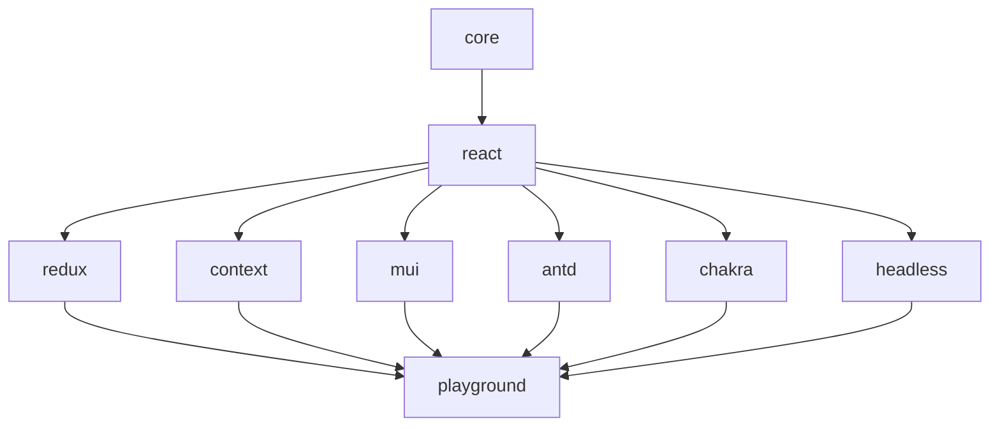

# React Dynamic Forms - NPM Library Implementation Plan

## 📋 Executive Summary

**Project:** Transform existing dynamic forms system into a production-grade NPM library
**Timeline:** 4-6 weeks (160-240 hours)
**Architecture:** Monorepo with 8 packages
**Key Features:** UI-agnostic, tree-shakeable, flexible state management

---

## 🎯 Project Goals

### Primary Objectives

1. ✅ **UI Framework Agnostic**: Core logic independent of any UI library
2. ✅ **Lightweight**: Users import only what they need (tree-shaking enabled)
3. ✅ **Flexible State Management**: Support both Redux and React Context
4. ✅ **Render Props Pattern**: Maximum customization flexibility
5. ✅ **Monorepo Structure**: Clean separation of concerns
6. ✅ **Developer Experience**: Comprehensive examples and playground

### Success Criteria

- Bundle size <50KB for typical usage (core + react)
- Tree-shaking reduces unused code by 30-40%
- TypeScript types 100% coverage
- Test coverage >85%
- Documentation with interactive examples
- <24h issue response time target

---

## 🏗️ Target Architecture

### Monorepo Structure

```
react-dynamic-forms/
├── packages/
│   ├── core/                          # Pure TypeScript logic
│   ├── react/                         # React hooks & render props
│   ├── redux/                         # Redux Toolkit integration
│   ├── context/                       # React Context alternative
│   ├── mui/                          # Material-UI components
│   ├── antd/                         # Ant Design components (future)
│   ├── chakra/                       # Chakra UI components (future)
│   └── headless/                     # Unstyled components
├── apps/
│   ├── playground/                    # Interactive examples
│   ├── docs/                         # Documentation site
│   └── demo/                         # Live demo application
├── tools/
│   └── scripts/                      # Build & release scripts
├── package.json                       # Root workspace config
├── pnpm-workspace.yaml               # pnpm workspace config
├── turbo.json                        # Turborepo config
└── README.md
```

### Package Dependencies Flow



---

## 📦 Package Details

### 1. @react-dynamic-forms/core

**Purpose:** UI-agnostic core logic
**Size Target:** <50KB minified
**Dependencies:** ZERO

**Exports:**

```typescript
// Types
export * from "./types/schema.types";
export * from "./types/validation.types";
export * from "./types/state.types";

// Utils
export {
  parseSchema,
  buildValidationSchema,
  resolveDependencies,
  checkPermissions,
} from "./utils";

// Services
export {
  validateField,
  validateStep,
  submitForm,
  saveDraft,
  restoreDraft,
} from "./services";
```

**Files to Extract:**

- `types/*.ts` → All type definitions
- `utils/*.ts` → All utilities
- `services/*.ts` → Core services (no React dependencies)

---

### 2. @react-dynamic-forms/react

**Purpose:** React-specific hooks and providers
**Size Target:** <30KB minified
**Dependencies:** `@react-dynamic-forms/core`, `react`

**Exports:**

```typescript
// Hooks
export { useFormOrchestrator } from "./hooks/useFormOrchestrator";
export { useFieldDependencies } from "./hooks/useFieldDependencies";
export { useAutoSave } from "./hooks/useAutoSave";
export { useAsyncValidation } from "./hooks/useAsyncValidation";

// Render Props Components
export { FormProvider } from "./components/FormProvider";
export { FormRenderer } from "./components/FormRenderer";
export { StepRenderer } from "./components/StepRenderer";
export { FieldRenderer } from "./components/FieldRenderer";

// Headless Components
export { HeadlessForm } from "./components/HeadlessForm";
export { HeadlessField } from "./components/HeadlessField";
```

**Files to Extract:**

- `hooks/*.ts` → All hooks (refactor to remove UI dependencies)
- Create new render props components

---

### 3. @react-dynamic-forms/redux

**Purpose:** Redux Toolkit integration
**Size Target:** <25KB minified
**Dependencies:** `@react-dynamic-forms/core`, `@react-dynamic-forms/react`, `@reduxjs/toolkit`, `react-redux`

**Exports:**

```typescript
// Redux Slice
export { formReducer, formActions } from "./store/formSlice";
export * from "./store/formSelectors";

// Hooks
export { useReduxForm } from "./hooks/useReduxForm";
export { useFormSelector } from "./hooks/useFormSelector";
export { useFormActions } from "./hooks/useFormActions";

// Middleware
export { formMiddleware } from "./middleware/formMiddleware";

// Types
export * from "./types/redux.types";
```

**Files to Extract:**

- `store/formSlice.ts` → Redux slice
- `store/formSelectors.ts` → Selectors
- Create new Redux-specific hooks

---

### 4. @react-dynamic-forms/context

**Purpose:** React Context API alternative
**Size Target:** <15KB minified
**Dependencies:** `@react-dynamic-forms/core`, `@react-dynamic-forms/react`

**Exports:**

```typescript
// Context Provider
export { FormContextProvider } from "./provider/FormContextProvider";

// Hooks
export { useFormContext } from "./hooks/useFormContext";
export { useFormState } from "./hooks/useFormState";
export { useFormActions } from "./hooks/useFormActions";

// Types
export * from "./types/context.types";
```

**New Implementation:**

- Create Context-based state management
- Implement reducer for state updates
- Create custom hooks for accessing state

---

### 5. @react-dynamic-forms/mui

**Purpose:** Material-UI component implementations
**Size Target:** <80KB minified
**Dependencies:** `@react-dynamic-forms/react`, `@mui/material`, `@emotion/react`

**Exports:**

```typescript
// High-Level Components
export { MuiFormContainer } from "./components/FormContainer";
export { MuiStepRenderer } from "./components/StepRenderer";

// Field Components
export { MuiTextField } from "./fields/TextField";
export { MuiSelectField } from "./fields/SelectField";
export { MuiDateField } from "./fields/DateField";
export { MuiFileUploadField } from "./fields/FileUploadField";
// ... all field types

// Layout Components
export { MuiProgressIndicator } from "./components/ProgressIndicator";
export { MuiNavigationButtons } from "./components/NavigationButtons";
export { MuiErrorSummary } from "./components/ErrorSummary";
```

**Files to Extract:**

- `components/*.tsx` → All components
- `components/fields/*.tsx` → All field components

---

### 6. @react-dynamic-forms/headless

**Purpose:** Unstyled, accessible components
**Size Target:** <20KB minified
**Dependencies:** `@react-dynamic-forms/react`

**Exports:**

```typescript
// Headless Components
export { HeadlessFormContainer } from "./components/FormContainer";
export { HeadlessField } from "./components/Field";
export { HeadlessSelect } from "./components/Select";
export { HeadlessDatePicker } from "./components/DatePicker";

// Composition Primitives
export { useFieldProps } from "./hooks/useFieldProps";
export { useFieldState } from "./hooks/useFieldState";
```

**New Implementation:**

- Create unstyled versions of all components
- Focus on accessibility (ARIA attributes)
- Provide render props for maximum flexibility

---

### 7. playground (app)

**Purpose:** Interactive examples and testing
**Tech Stack:** React, Vite, TypeScript

**Features:**

- 20+ pre-built form examples
- Live schema editor with syntax highlighting
- Real-time form preview
- Code generation (copy-paste ready)
- Multiple UI framework previews
- Mobile/desktop responsive testing
- Performance benchmarking
- Schema import/export
- Shareable links

---

### 8. docs (app)

**Purpose:** Documentation website
**Tech Stack:** Docusaurus or Nextra

**Sections:**

- Getting Started
- Installation guides
- API Reference
- Component demos
- Migration guides
- Best practices
- Examples library
- FAQ

---

## 🗓️ Implementation Timeline

### Phase 1: Foundation & Core Setup (Week 1-2, 40-50 hours)

#### Week 1: Monorepo Setup

**Days 1-2: Infrastructure Setup (16 hours)**

- [ ] Initialize monorepo with Turborepo + pnpm
- [ ] Setup root-level configuration
  - ESLint, Prettier, TypeScript base config
  - Git hooks (Husky + lint-staged)
  - Commitlint for conventional commits
- [ ] Setup CI/CD pipeline (GitHub Actions)
  - Build workflow
  - Test workflow
  - Release workflow (Changesets)
- [ ] Create package templates

**Complexity:** 🟡 Medium
**Risk:** Low
**Blockers:** None

**Deliverables:**

```
react-dynamic-forms/
├── packages/ (empty, ready for packages)
├── .github/workflows/
│   ├── ci.yml
│   ├── release.yml
│   └── test.yml
├── package.json
├── pnpm-workspace.yaml
├── turbo.json
├── .husky/
├── .eslintrc.js
├── .prettierrc
└── tsconfig.base.json
```

---

**Days 3-5: Core Package Creation (24 hours)**

- [ ] Create `@react-dynamic-forms/core` package
- [ ] Extract and refactor type definitions
  - Remove React-specific types
  - Create pure TypeScript interfaces
  - Add JSDoc comments
- [ ] Extract utility functions
  - `schemaParser.ts`
  - `validationMapper.ts`
  - `dependencyResolver.ts`
  - `permissionChecker.ts`
- [ ] Extract core services
  - Refactor to remove React/Redux dependencies
  - Make async operations Promise-based
  - Add proper error handling
- [ ] Setup build configuration (tsup)
- [ ] Write unit tests for core logic
- [ ] Generate API documentation

**Complexity:** 🔴 High
**Risk:** Medium (refactoring complexity)
**Blockers:** Existing code has React dependencies

**Files to Refactor:**

| Source File                     | Target Package   | Changes Required        |
| ------------------------------- | ---------------- | ----------------------- |
| `types/schema.types.ts`         | `core/types/`    | Remove React types      |
| `types/form.types.ts`           | `core/types/`    | Extract non-React types |
| `types/validation.types.ts`     | `core/types/`    | No changes needed       |
| `utils/schemaParser.ts`         | `core/utils/`    | Remove React imports    |
| `utils/validationMapper.ts`     | `core/utils/`    | Refactor Yup dependency |
| `utils/dependencyResolver.ts`   | `core/utils/`    | Pure TypeScript         |
| `utils/permissionChecker.ts`    | `core/utils/`    | Pure TypeScript         |
| `services/validationService.ts` | `core/services/` | Remove React Hook Form  |
| `services/submissionService.ts` | `core/services/` | Generic HTTP client     |
| `services/prefillService.ts`    | `core/services/` | Generic HTTP client     |

**Deliverables:**

```typescript
// @react-dynamic-forms/core
export interface FormSchema {
  /* ... */
}
export interface FieldConfig {
  /* ... */
}
export { parseSchema } from "./utils/schemaParser";
export { buildYupSchema } from "./utils/validationMapper";
export { resolveDependencies } from "./utils/dependencyResolver";
export { checkPermissions } from "./utils/permissionChecker";
```

---

#### Week 2: React Package

**Days 1-3: React Package Creation (24 hours)**

- [ ] Create `@react-dynamic-forms/react` package
- [ ] Extract and refactor hooks
  - Make them UI-agnostic
  - Remove MUI dependencies
  - Add proper TypeScript generics
- [ ] Create render props components
  - `FormProvider` with render prop pattern
  - `FormRenderer` (headless)
  - `StepRenderer` (headless)
  - `FieldRenderer` (headless)
- [ ] Create headless components
  - Focus on logic, not presentation
  - Provide callback props
  - Expose internal state
- [ ] Setup build configuration
- [ ] Write integration tests
- [ ] Document render props API

**Complexity:** 🔴 High
**Risk:** Medium (architectural changes)
**Blockers:** Depends on core package completion

**Render Props Pattern Example:**

```typescript
// Before: Tightly coupled to MUI
<FormContainer schema={schema} />

// After: Flexible render props
<FormProvider schema={schema}>
  {({ currentStep, fields, goNext, goBack, submit }) => (
    <div>
      <h1>Step {currentStep}</h1>
      {fields.map(field => (
        <YourCustomField key={field.id} {...field} />
      ))}
      <button onClick={goBack}>Back</button>
      <button onClick={goNext}>Next</button>
      <button onClick={submit}>Submit</button>
    </div>
  )}
</FormProvider>
```

**Files to Refactor:**

| Source File                      | Target Package | Changes Required           |
| -------------------------------- | -------------- | -------------------------- |
| `hooks/useFormOrchestrator.ts`   | `react/hooks/` | Remove Redux, make generic |
| `hooks/useStepNavigation.ts`     | `react/hooks/` | Remove Redux               |
| `hooks/useFieldValidation.ts`    | `react/hooks/` | Generic validation         |
| `hooks/useFieldDependencies.ts`  | `react/hooks/` | Minor refactor             |
| `hooks/useAutoSave.ts`           | `react/hooks/` | Generic storage interface  |
| `hooks/useAsyncValidation.ts`    | `react/hooks/` | Minor refactor             |
| `hooks/useSessionPersistence.ts` | `react/hooks/` | Generic interface          |

**New Components to Create:**

- `FormProvider.tsx` - Context provider with render props
- `FormRenderer.tsx` - Headless form renderer
- `StepRenderer.tsx` - Headless step renderer
- `FieldRenderer.tsx` - Headless field renderer
- `HeadlessForm.tsx` - Fully headless composition component

**Deliverables:**

```typescript
// @react-dynamic-forms/react
export { FormProvider } from "./components/FormProvider";
export { useFormOrchestrator } from "./hooks/useFormOrchestrator";
export { useFieldDependencies } from "./hooks/useFieldDependencies";
// ... all hooks and components
```

---

**Days 4-5: Testing & Documentation (16 hours)**

- [ ] Write comprehensive unit tests
  - Test all hooks with React Testing Library
  - Test render props behavior
  - Test error scenarios
- [ ] Write integration tests
  - Multi-step navigation flow
  - Field validation flow
  - Form submission flow
- [ ] Create API documentation
  - JSDoc comments
  - TypeDoc generation
  - Usage examples
- [ ] Create migration guide from current implementation

**Complexity:** 🟡 Medium
**Risk:** Low
**Blockers:** Depends on package completion

---

### Phase 2: State Management Packages (Week 2-3, 40-50 hours)

#### Week 2 (continued): Redux Package

**Days 1-3: Redux Package Creation (24 hours)**

- [ ] Create `@react-dynamic-forms/redux` package
- [ ] Extract Redux slice and selectors
- [ ] Create Redux-specific hooks
  - `useReduxForm()` - Main hook wrapping Redux dispatch
  - `useFormSelector()` - Memoized selector hook
  - `useFormActions()` - Bound action creators
- [ ] Create middleware for side effects
  - Auto-save middleware
  - Async validation middleware
  - Form submission middleware
- [ ] Enhance selectors with Reselect
- [ ] Setup build configuration
- [ ] Write Redux-specific tests
- [ ] Document Redux integration

**Complexity:** 🟢 Low
**Risk:** Low (mostly extraction)
**Blockers:** Depends on react package

**Files to Extract:**

| Source File              | Target Package | Changes Required      |
| ------------------------ | -------------- | --------------------- |
| `store/formSlice.ts`     | `redux/store/` | Minor cleanup         |
| `store/formSelectors.ts` | `redux/store/` | Enhance with Reselect |

**New Files to Create:**

- `hooks/useReduxForm.ts` - Main Redux hook
- `hooks/useFormSelector.ts` - Selector helper hook
- `hooks/useFormActions.ts` - Actions helper hook
- `middleware/formMiddleware.ts` - Custom middleware
- `types/redux.types.ts` - Redux-specific types

**Deliverables:**

```typescript
// @react-dynamic-forms/redux
export { formReducer, formActions } from "./store/formSlice";
export * from "./store/formSelectors";
export { useReduxForm } from "./hooks/useReduxForm";
export { formMiddleware } from "./middleware/formMiddleware";
```

**Usage Example:**

```typescript
// In store.ts
import { configureStore } from "@reduxjs/toolkit";
import { formReducer } from "@react-dynamic-forms/redux";

const store = configureStore({
  reducer: {
    dynamicForms: formReducer,
  },
});

// In component
import { useReduxForm } from "@react-dynamic-forms/redux";

function MyForm() {
  const { currentStep, goNext, submit } = useReduxForm("my-form-id");
  // ... use form
}
```

---

#### Week 3: Context Package

**Days 1-2: Context Package Creation (16 hours)**

- [ ] Create `@react-dynamic-forms/context` package
- [ ] Implement Context-based state management
  - Create FormContext with useReducer
  - Implement reducer for all form actions
  - Handle complex state updates
- [ ] Create Context-specific hooks
  - `useFormContext()` - Access form context
  - `useFormState()` - Access form state
  - `useFormActions()` - Access form actions
- [ ] Implement performance optimizations
  - Split contexts for rarely-changed vs frequently-changed state
  - Memoize context values
  - Use selectors to prevent unnecessary re-renders
- [ ] Setup build configuration
- [ ] Write Context-specific tests
- [ ] Document Context integration

**Complexity:** 🟢 Low
**Risk:** Low
**Blockers:** Depends on react package

**New Files to Create:**

- `provider/FormContextProvider.tsx` - Main context provider
- `context/FormContext.tsx` - Context definitions
- `reducer/formReducer.ts` - State reducer
- `hooks/useFormContext.ts` - Main context hook
- `hooks/useFormState.ts` - State selector hook
- `hooks/useFormActions.ts` - Actions hook
- `types/context.types.ts` - Context-specific types

**Deliverables:**

```typescript
// @react-dynamic-forms/context
export { FormContextProvider } from "./provider/FormContextProvider";
export { useFormContext } from "./hooks/useFormContext";
export { useFormState } from "./hooks/useFormState";
export { useFormActions } from "./hooks/useFormActions";
```

**Usage Example:**

```typescript
import {
  FormContextProvider,
  useFormContext,
} from "@react-dynamic-forms/context";

function App() {
  return (
    <FormContextProvider schema={schema}>
      <MyForm />
    </FormContextProvider>
  );
}

function MyForm() {
  const { currentStep, goNext, submit } = useFormContext();
  // ... use form
}
```

---

**Day 3: State Management Comparison & Documentation (8 hours)**

- [ ] Create comparison guide: Redux vs Context
- [ ] Document when to use each approach
- [ ] Create migration examples
- [ ] Add performance benchmarks
- [ ] Document trade-offs and best practices

**Deliverable:** Comprehensive guide helping users choose between Redux and Context

---

### Phase 3: UI Framework Packages (Week 3-4, 40-50 hours)

#### Week 3 (continued): Material-UI Package

**Days 4-5: MUI Package Creation (16 hours)**

- [ ] Create `@react-dynamic-forms/mui` package
- [ ] Extract all existing MUI components
- [ ] Refactor to use render props from `@react-dynamic-forms/react`
- [ ] Ensure components are customizable
  - Theme support
  - Style overrides
  - Custom components injection
- [ ] Setup build configuration
- [ ] Write component tests
- [ ] Create Storybook stories
- [ ] Document MUI integration

**Complexity:** 🟡 Medium
**Risk:** Low (mostly extraction)
**Blockers:** Depends on react package

**Files to Extract:**

| Source File                        | Target Package    | Changes                |
| ---------------------------------- | ----------------- | ---------------------- |
| `components/FormContainer.tsx`     | `mui/components/` | Wrap with FormProvider |
| `components/StepRenderer.tsx`      | `mui/components/` | Use render props       |
| `components/FieldRenderer.tsx`     | `mui/components/` | Use render props       |
| `components/ProgressIndicator.tsx` | `mui/components/` | Minor refactor         |
| `components/NavigationButtons.tsx` | `mui/components/` | Minor refactor         |
| `components/ErrorSummary.tsx`      | `mui/components/` | Minor refactor         |
| `components/fields/*.tsx`          | `mui/fields/`     | All field components   |

**Deliverables:**

```typescript
// @react-dynamic-forms/mui
export { MuiFormContainer } from "./components/FormContainer";
export { MuiStepRenderer } from "./components/StepRenderer";
export * from "./fields";
```

---

#### Week 4: Headless Package

**Days 1-3: Headless Package Creation (24 hours)**

- [ ] Create `@react-dynamic-forms/headless` package
- [ ] Implement unstyled, accessible components
  - Focus on ARIA attributes
  - Keyboard navigation
  - Screen reader support
- [ ] Create primitive components
  - `HeadlessField` - Basic field wrapper
  - `HeadlessSelect` - Accessible select
  - `HeadlessCheckbox` - Accessible checkbox
  - `HeadlessRadio` - Accessible radio group
  - `HeadlessDatePicker` - Date picker logic
- [ ] Provide composition utilities
  - `useFieldProps()` - Field prop getter
  - `useFieldState()` - Field state hook
  - `useFieldEvents()` - Event handlers
- [ ] Setup build configuration
- [ ] Write accessibility tests
- [ ] Create usage examples
- [ ] Document headless patterns

**Complexity:** 🟡 Medium
**Risk:** Medium (accessibility complexity)
**Blockers:** Depends on react package

**New Files to Create:**

- `components/Field.tsx` - Base field component
- `components/Select.tsx` - Headless select
- `components/Checkbox.tsx` - Headless checkbox
- `components/Radio.tsx` - Headless radio
- `components/DatePicker.tsx` - Headless date picker
- `hooks/useFieldProps.ts` - Field props hook
- `hooks/useFieldState.ts` - Field state hook
- `hooks/useFieldEvents.ts` - Event handlers hook

**Deliverables:**

```typescript
// @react-dynamic-forms/headless
export { HeadlessField } from "./components/Field";
export { HeadlessSelect } from "./components/Select";
export { useFieldProps } from "./hooks/useFieldProps";
export { useFieldState } from "./hooks/useFieldState";
```

**Usage Example:**

```typescript
import { HeadlessField, useFieldProps } from "@react-dynamic-forms/headless";

function CustomTextField({ name, label }) {
  const { value, onChange, onBlur, error } = useFieldProps(name);

  return (
    <HeadlessField name={name}>
      {({ fieldId, labelId, errorId }) => (
        <div>
          <label id={labelId} htmlFor={fieldId}>
            {label}
          </label>
          <input
            id={fieldId}
            value={value}
            onChange={onChange}
            onBlur={onBlur}
            aria-describedby={error ? errorId : undefined}
            aria-invalid={!!error}
          />
          {error && (
            <span id={errorId} role="alert">
              {error}
            </span>
          )}
        </div>
      )}
    </HeadlessField>
  );
}
```

---

**Days 4-5: UI Packages Polish & Testing (16 hours)**

- [ ] Cross-package integration testing
- [ ] Accessibility testing (axe-core)
- [ ] Performance testing
- [ ] Visual regression testing (Percy or Chromatic)
- [ ] Documentation refinement
- [ ] Create component showcase

---

### Phase 4: Playground & Documentation (Week 4-5, 40-50 hours)

#### Week 4 (continued): Playground Development

**Day 5 + Week 5 Days 1-2: Playground App (24 hours)**

- [ ] Create `playground` app with Vite + React
- [ ] Implement core features
  - **Schema Editor**
    - Monaco Editor with JSON syntax highlighting
    - Real-time validation
    - Schema templates library
    - Import/export functionality
  - **Live Preview**
    - Side-by-side editor and preview
    - Multiple UI framework tabs (MUI, Headless)
    - Responsive preview (mobile/tablet/desktop)
    - Hot reload on schema changes
  - **Code Generation**
    - Generate TypeScript/JavaScript code
    - Copy to clipboard
    - Download as file
    - Show different integration examples
  - **Examples Library**
    - 20+ pre-built examples
    - Categories: Basic, Intermediate, Advanced
    - Searchable and filterable
    - Clone to editor functionality
- [ ] Implement additional features
  - Theme switcher (light/dark)
  - Performance benchmarking
  - Schema validation errors display
  - Shareable links (encode schema in URL)
  - Local storage for draft schemas
- [ ] Setup deployment (Vercel/Netlify)
- [ ] Add analytics (Google Analytics or Plausible)

**Complexity:** 🟡 Medium
**Risk:** Low
**Blockers:** Depends on all packages

**Tech Stack:**

- Vite
- React 18
- Monaco Editor
- TailwindCSS
- React Router
- URL state management

**Playground Structure:**

```
apps/playground/
├── src/
│   ├── components/
│   │   ├── SchemaEditor.tsx
│   │   ├── LivePreview.tsx
│   │   ├── CodeGenerator.tsx
│   │   ├── ExamplesLibrary.tsx
│   │   ├── FrameworkTabs.tsx
│   │   └── PerformanceBenchmark.tsx
│   ├── examples/
│   │   ├── basic/
│   │   ├── intermediate/
│   │   └── advanced/
│   ├── utils/
│   │   ├── schemaValidator.ts
│   │   ├── codeGenerator.ts
│   │   └── urlStateManager.ts
│   └── App.tsx
└── package.json
```

**Example Categories:**

1. **Basic (6 examples)**

   - Simple contact form
   - Login form
   - Newsletter signup
   - Feedback form
   - Search form
   - Survey form

2. **Intermediate (8 examples)**

   - Multi-step employee onboarding
   - Product order form
   - Customer registration
   - Event registration
   - Appointment booking
   - Lead capture form
   - Application form
   - Support ticket

3. **Advanced (6 examples)**
   - Insurance claim form with conditional logic
   - Tax return form with calculations
   - Loan application with file uploads
   - Medical questionnaire with dependencies
   - Complex e-commerce checkout
   - Dynamic survey builder

---

#### Week 5 Days 3-5: Documentation Site (24 hours)

- [ ] Create `docs` app with Docusaurus or Nextra
- [ ] Write comprehensive documentation
  - **Getting Started**
    - Introduction
    - Quick start guide
    - Installation
    - Your first form
  - **Guides**
    - Basic form creation
    - Multi-step forms
    - Field validation
    - Conditional logic
    - File uploads
    - Async validation
    - Auto-save & drafts
    - State management (Redux vs Context)
    - Custom UI components
    - Theming & styling
    - Performance optimization
  - **API Reference**
    - Core API
    - React API
    - Redux API
    - Context API
    - MUI API
    - Headless API
    - Types reference
  - **Examples**
    - Embed playground examples
    - Step-by-step tutorials
    - Real-world use cases
  - **Migration Guides**
    - From current implementation
    - Version upgrade guides
  - **Contributing**
    - Development setup
    - Coding guidelines
    - Testing guidelines
    - PR process
- [ ] Setup search (Algolia DocSearch)
- [ ] Add interactive demos
- [ ] Setup versioning
- [ ] Deploy documentation site
- [ ] Add feedback widget

**Complexity:** 🟡 Medium
**Risk:** Low
**Blockers:** Depends on packages completion

**Documentation Structure:**

```
apps/docs/
├── docs/
│   ├── getting-started/
│   │   ├── introduction.md
│   │   ├── installation.md
│   │   └── quick-start.md
│   ├── guides/
│   │   ├── basic-form.md
│   │   ├── multi-step.md
│   │   ├── validation.md
│   │   ├── conditional-logic.md
│   │   └── ... (more guides)
│   ├── api/
│   │   ├── core/
│   │   ├── react/
│   │   ├── redux/
│   │   ├── context/
│   │   └── mui/
│   ├── examples/
│   │   └── ... (tutorials)
│   └── migration/
│       └── v1-to-v2.md
├── blog/
│   └── ... (release notes, tutorials)
└── docusaurus.config.js
```

---

### Phase 5: Testing & Quality Assurance (Week 5-6, 30-40 hours)

#### Week 5 (continued): Testing Infrastructure

**Days 5-6: Testing Setup (16 hours)**

- [ ] Setup Vitest for all packages
- [ ] Setup React Testing Library
- [ ] Setup Playwright for E2E tests
- [ ] Configure coverage reporting (Istanbul/c8)
- [ ] Setup visual regression testing (Chromatic)
- [ ] Configure test CI pipeline
- [ ] Add pre-commit test hooks

**Complexity:** 🟡 Medium
**Risk:** Low
**Blockers:** None

---

#### Week 6: Comprehensive Testing

**Days 1-2: Unit Tests (16 hours)**

- [ ] Core package tests
  - Schema parser (edge cases)
  - Validation mapper (all rules)
  - Dependency resolver (complex chains)
  - Permission checker (role combinations)
  - All utility functions
- [ ] React package tests
  - All hooks (happy path + errors)
  - Render props behavior
  - Context providers
  - Headless components
- [ ] Redux/Context package tests
  - State management logic
  - Selector memoization
  - Action creators
  - Middleware behavior
- [ ] UI package tests
  - Component rendering
  - User interactions
  - Error states
  - Accessibility

**Target:** >85% code coverage

---

**Day 3: Integration Tests (8 hours)**

- [ ] Form flow tests
  - Multi-step navigation
  - Field validation flow
  - Conditional logic execution
  - Form submission
  - Draft save/restore
  - Auto-save behavior
- [ ] Cross-package integration
  - Redux + MUI
  - Context + Headless
  - Different state management strategies
- [ ] Error handling
  - Network errors
  - Validation errors
  - Unexpected scenarios

---

**Day 4: E2E Tests (8 hours)**

- [ ] Playground E2E tests
  - Schema editing
  - Live preview updates
  - Code generation
  - Example loading
- [ ] Demo app E2E tests
  - Complete form flows
  - Different UI frameworks
  - Mobile/desktop experiences
- [ ] Accessibility testing
  - Keyboard navigation
  - Screen reader compatibility
  - ARIA attributes

---

**Day 5: Performance & Bundle Size Testing (8 hours)**

- [ ] Bundle size analysis
  - Measure each package
  - Verify tree-shaking works
  - Check for duplicate dependencies
  - Optimize if needed
- [ ] Performance benchmarking
  - Form with 50 fields
  - Form with 200 fields
  - Navigation performance
  - Validation performance
- [ ] Load testing
  - Initial load time
  - Bundle download size
  - Runtime performance
- [ ] Document performance characteristics

**Performance Targets:**

- Initial load: <1s (core + react)
- 50 field form: <100ms interaction time
- 200 field form: <200ms interaction time
- Tree-shaking: 30-40% size reduction

---

### Phase 6: Publishing & Release (Week 6, 20-30 hours)

#### Week 6: Preparation & Launch

**Days 1-2: Pre-Release Preparation (16 hours)**

- [ ] Versioning setup
  - Initialize Changesets
  - Write CHANGELOG.md for each package
  - Tag initial version (1.0.0)
- [ ] Package metadata
  - package.json: description, keywords, homepage
  - README.md for each package
  - LICENSE files
  - .npmignore files
- [ ] NPM organization setup
  - Create NPM organization (@your-org)
  - Add team members
  - Setup 2FA
- [ ] Security audit
  - Run npm audit
  - Fix vulnerabilities
  - Setup Snyk or Dependabot
- [ ] Final code review
  - Code quality check
  - Documentation review
  - Example verification

**Complexity:** 🟢 Low
**Risk:** Low
**Blockers:** Testing completion

---

**Day 3: Release Process (8 hours)**

- [ ] Dry-run publishing
  - Test package builds
  - Verify exports
  - Test installation locally
- [ ] Setup automated releases
  - GitHub Actions release workflow
  - Changesets automation
  - NPM publish automation
- [ ] Publish to NPM
  - Publish @react-dynamic-forms/core
  - Publish @react-dynamic-forms/react
  - Publish @react-dynamic-forms/redux
  - Publish @react-dynamic-forms/context
  - Publish @react-dynamic-forms/mui
  - Publish @react-dynamic-forms/headless
- [ ] Verify installations
  - Test install in blank project
  - Verify all exports work
  - Check TypeScript types

---

**Day 4: Post-Release Activities (8 hours)**

- [ ] Community setup
  - Create GitHub Discussions
  - Setup issue templates
  - Create PR template
  - Write CONTRIBUTING.md
  - Setup Discord or Slack community
- [ ] Marketing & outreach
  - Write blog post announcement
  - Post on Reddit (r/reactjs, r/javascript)
  - Tweet announcement
  - Post on Dev.to
  - Submit to JavaScript Weekly
- [ ] Monitor initial feedback
  - Watch GitHub issues
  - Respond to questions
  - Fix urgent bugs
- [ ] Setup analytics
  - NPM download tracking
  - Documentation analytics
  - Playground usage analytics

---

**Day 5: Maintenance Setup (8 hours)**

- [ ] Setup support processes
  - Issue triage guidelines
  - Response time targets (<24h)
  - Severity classification
- [ ] Create roadmap
  - Feature requests tracking
  - Version planning
  - Community input process
- [ ] Setup automated tasks
  - Dependency updates (Renovate)
  - Security alerts (Dependabot)
  - Stale issue management
- [ ] Documentation updates
  - Add troubleshooting section
  - FAQ from initial feedback
  - Known issues list

---

## 📊 Detailed Task Breakdown by Package

### Package 1: @react-dynamic-forms/core

**Total Effort:** 24 hours
**Complexity:** 🔴 High

#### Tasks:

1. **Setup package structure** (2h)

   ```
   packages/core/
   ├── src/
   │   ├── types/
   │   ├── utils/
   │   ├── services/
   │   └── index.ts
   ├── package.json
   ├── tsconfig.json
   ├── tsup.config.ts
   └── README.md
   ```

2. **Extract type definitions** (4h)

   - Copy from `types/*.ts`
   - Remove React-specific types
   - Add comprehensive JSDoc
   - Export all types

3. **Extract utilities** (6h)

   - `schemaParser.ts` - Parse JSON schemas
   - `validationMapper.ts` - Build Yup schemas
   - `dependencyResolver.ts` - Resolve field dependencies
   - `permissionChecker.ts` - Check user permissions
   - Remove any React dependencies
   - Make pure functions

4. **Extract services** (8h)

   - `validationService.ts` - Validation logic
   - `submissionService.ts` - Form submission
   - `prefillService.ts` - Prefill data
   - Refactor to use generic HTTP client interface
   - Remove React Hook Form dependencies
   - Make promise-based

5. **Setup build & tests** (4h)
   - Configure tsup for ESM/CJS builds
   - Write unit tests (>85% coverage)
   - Setup test utilities
   - Configure type generation

**Critical Success Factors:**

- ✅ ZERO dependencies on React
- ✅ Pure TypeScript/JavaScript
- ✅ Works in Node.js and browser
- ✅ Fully typed with TypeScript
- ✅ <50KB bundle size

---

### Package 2: @react-dynamic-forms/react

**Total Effort:** 24 hours
**Complexity:** 🔴 High

#### Tasks:

1. **Setup package structure** (2h)

   ```
   packages/react/
   ├── src/
   │   ├── hooks/
   │   ├── components/
   │   ├── context/
   │   └── index.ts
   ├── package.json
   ├── tsconfig.json
   └── tsup.config.ts
   ```

2. **Extract and refactor hooks** (10h)

   - `useFormOrchestrator.ts`
     - Remove Redux dependency
     - Accept generic state manager
     - Return form state and actions
   - `useFieldDependencies.ts`
     - Make UI-agnostic
     - Accept field config
     - Return visibility state
   - `useAutoSave.ts`
     - Accept generic storage interface
     - Make storage strategy pluggable
   - `useAsyncValidation.ts`
     - Accept validation function
     - Return validation state
   - `useSessionPersistence.ts`
     - Create interface for storage
     - Support different backends

3. **Create render props components** (8h)

   - `FormProvider.tsx`
     ```tsx
     <FormProvider schema={schema}>
       {(formState) => <YourUI {...formState} />}
     </FormProvider>
     ```
   - `FormRenderer.tsx` - Render current step
   - `StepRenderer.tsx` - Render step fields
   - `FieldRenderer.tsx` - Render single field

4. **Setup build & tests** (4h)
   - Configure build
   - Write hook tests with React Testing Library
   - Test render props behavior
   - Integration tests

**Critical Success Factors:**

- ✅ UI-agnostic (no MUI)
- ✅ Flexible render props
- ✅ Works with any state manager
- ✅ <30KB bundle size
- ✅ Full TypeScript support

---

### Package 3: @react-dynamic-forms/redux

**Total Effort:** 16 hours
**Complexity:** 🟢 Low

#### Tasks:

1. **Setup package structure** (2h)

   ```
   packages/redux/
   ├── src/
   │   ├── store/
   │   ├── hooks/
   │   ├── middleware/
   │   └── index.ts
   ```

2. **Extract Redux slice** (4h)

   - Copy `store/formSlice.ts`
   - Copy `store/formSelectors.ts`
   - Enhance selectors with Reselect
   - Add more granular selectors

3. **Create Redux hooks** (6h)

   - `useReduxForm.ts` - Main hook
     ```tsx
     const { currentStep, goNext, submit } = useReduxForm("formId");
     ```
   - `useFormSelector.ts` - Selector helper
   - `useFormActions.ts` - Action helper

4. **Create middleware** (2h)

   - Auto-save middleware
   - Async validation middleware
   - Logging middleware (optional)

5. **Testing** (2h)
   - Test reducers
   - Test selectors
   - Test hooks with Redux

**Critical Success Factors:**

- ✅ Easy Redux integration
- ✅ Optimized selectors
- ✅ <25KB bundle size
- ✅ Great DevTools support

---

### Package 4: @react-dynamic-forms/context

**Total Effort:** 16 hours
**Complexity:** 🟢 Low

#### Tasks:

1. **Setup package structure** (2h)

   ```
   packages/context/
   ├── src/
   │   ├── provider/
   │   ├── context/
   │   ├── reducer/
   │   ├── hooks/
   │   └── index.ts
   ```

2. **Create Context provider** (6h)

   - `FormContext.tsx` - Context definition
   - `FormContextProvider.tsx` - Provider with useReducer
   - `formReducer.ts` - State reducer
   - Handle all form actions
   - Performance optimization (split contexts)

3. **Create Context hooks** (4h)

   - `useFormContext.ts` - Main hook
     ```tsx
     const { currentStep, goNext, submit } = useFormContext();
     ```
   - `useFormState.ts` - State selector
   - `useFormActions.ts` - Action dispatcher

4. **Testing** (2h)

   - Test provider
   - Test reducer
   - Test hooks
   - Test performance

5. **Documentation** (2h)
   - Usage examples
   - Performance tips
   - Comparison with Redux

**Critical Success Factors:**

- ✅ Simple API
- ✅ Good performance
- ✅ <15KB bundle size
- ✅ Zero dependencies (except React)

---

### Package 5: @react-dynamic-forms/mui

**Total Effort:** 16 hours
**Complexity:** 🟡 Medium

#### Tasks:

1. **Setup package structure** (2h)

   ```
   packages/mui/
   ├── src/
   │   ├── components/
   │   ├── fields/
   │   ├── hooks/
   │   └── index.ts
   ```

2. **Extract components** (8h)

   - Copy all components from `components/`
   - Refactor to use render props from react package
   - Ensure theme compatibility
   - Add customization options

3. **Extract field components** (4h)

   - Copy all from `components/fields/`
   - Ensure consistency
   - Add prop forwarding for MUI props

4. **Testing & Storybook** (2h)
   - Component tests
   - Create Storybook stories
   - Visual testing

**Critical Success Factors:**

- ✅ Full MUI theme support
- ✅ Customizable components
- ✅ <80KB bundle size
- ✅ Accessible components

---

### Package 6: @react-dynamic-forms/headless

**Total Effort:** 24 hours
**Complexity:** 🟡 Medium

#### Tasks:

1. **Setup package structure** (2h)

2. **Create headless components** (12h)

   - `HeadlessField.tsx` - Base field
   - `HeadlessSelect.tsx` - Select component
   - `HeadlessCheckbox.tsx` - Checkbox
   - `HeadlessRadio.tsx` - Radio group
   - `HeadlessDatePicker.tsx` - Date picker logic
   - Focus on ARIA and accessibility
   - Keyboard navigation
   - Screen reader support

3. **Create composition hooks** (6h)

   - `useFieldProps.ts` - Get field props
   - `useFieldState.ts` - Get field state
   - `useFieldEvents.ts` - Event handlers
   - `useFieldAccessibility.ts` - ARIA props

4. **Testing** (4h)
   - Accessibility tests with axe-core
   - Keyboard navigation tests
   - Component tests
   - Integration tests

**Critical Success Factors:**

- ✅ Fully accessible (WCAG AA)
- ✅ Keyboard navigable
- ✅ Screen reader friendly
- ✅ <20KB bundle size

---

## 🧪 Testing Strategy

### Unit Tests (Target: >85% coverage)

**Core Package:**

```typescript
// Example: schemaParser.test.ts
describe("parseSchema", () => {
  it("should parse valid schema", () => {
    const schema = {
      /* ... */
    };
    const result = parseSchema(schema);
    expect(result).toMatchObject({
      /* ... */
    });
  });

  it("should throw on invalid schema", () => {
    const invalid = {
      /* ... */
    };
    expect(() => parseSchema(invalid)).toThrow();
  });
});
```

**React Package:**

```typescript
// Example: useFormOrchestrator.test.tsx
describe("useFormOrchestrator", () => {
  it("should handle navigation", () => {
    const { result } = renderHook(() => useFormOrchestrator(schema));

    act(() => {
      result.current.goNext();
    });

    expect(result.current.currentStep).toBe(2);
  });
});
```

### Integration Tests

**Form Flow:**

```typescript
// Example: form-flow.test.tsx
describe("Multi-step Form Flow", () => {
  it("should complete full form submission", async () => {
    render(<FormContainer schema={schema} />);

    // Step 1
    await userEvent.type(screen.getByLabelText("First Name"), "John");
    await userEvent.click(screen.getByText("Next"));

    // Step 2
    await userEvent.click(screen.getByText("Submit"));

    expect(onSubmit).toHaveBeenCalledWith(expectedData);
  });
});
```

### E2E Tests

**Playground:**

```typescript
// Example: playground.spec.ts
test("should update preview on schema change", async ({ page }) => {
  await page.goto("/playground");

  // Edit schema
  await page.fill(".monaco-editor", newSchema);

  // Check preview updated
  const preview = page.locator(".preview-panel");
  await expect(preview).toContainText("Expected Field");
});
```

### Performance Tests

**Bundle Size:**

```bash
# Check bundle sizes
pnpm run build:analyze

# Expected output:
# @react-dynamic-forms/core: 45KB
# @react-dynamic-forms/react: 28KB
# @react-dynamic-forms/redux: 22KB
# @react-dynamic-forms/context: 12KB
# @react-dynamic-forms/mui: 75KB
```

**Runtime Performance:**

```typescript
// Example: performance.test.ts
describe("Performance", () => {
  it("should render 200 fields under 200ms", () => {
    const start = performance.now();

    render(<FormContainer schema={largeSchema} />);

    const duration = performance.now() - start;
    expect(duration).toBeLessThan(200);
  });
});
```

---

## 🔧 Build & Tooling Configuration

### Root package.json

```json
{
  "name": "react-dynamic-forms-monorepo",
  "private": true,
  "workspaces": ["packages/*", "apps/*"],
  "scripts": {
    "build": "turbo run build",
    "test": "turbo run test",
    "lint": "turbo run lint",
    "dev": "turbo run dev --parallel",
    "changeset": "changeset",
    "release": "turbo run build --filter='@react-dynamic-forms/*' && changeset publish"
  },
  "devDependencies": {
    "@changesets/cli": "^2.27.0",
    "@typescript-eslint/eslint-plugin": "^6.0.0",
    "@typescript-eslint/parser": "^6.0.0",
    "eslint": "^8.50.0",
    "prettier": "^3.0.0",
    "turbo": "^1.11.0",
    "typescript": "^5.3.0"
  }
}
```

### turbo.json

```json
{
  "$schema": "https://turbo.build/schema.json",
  "pipeline": {
    "build": {
      "dependsOn": ["^build"],
      "outputs": ["dist/**", ".next/**"]
    },
    "test": {
      "dependsOn": ["build"],
      "outputs": ["coverage/**"]
    },
    "lint": {
      "outputs": []
    },
    "dev": {
      "cache": false,
      "persistent": true
    }
  }
}
```

### tsup.config.ts (for packages)

```typescript
import { defineConfig } from "tsup";

export default defineConfig({
  entry: ["src/index.ts"],
  format: ["esm", "cjs"],
  dts: true,
  splitting: true,
  sourcemap: true,
  clean: true,
  treeshake: true,
  minify: true,
  external: ["react", "react-dom"],
});
```

### tsconfig.base.json

```json
{
  "compilerOptions": {
    "target": "ES2020",
    "module": "ESNext",
    "lib": ["ES2020", "DOM", "DOM.Iterable"],
    "jsx": "react-jsx",
    "moduleResolution": "bundler",
    "strict": true,
    "esModuleInterop": true,
    "skipLibCheck": true,
    "declaration": true,
    "declarationMap": true,
    "sourceMap": true,
    "noUnusedLocals": true,
    "noUnusedParameters": true,
    "noImplicitReturns": true
  }
}
```

---

## 📋 Checklist: Pre-Release Verification

### Code Quality

- [ ] All TypeScript errors resolved
- [ ] ESLint passes with no warnings
- [ ] Prettier formatting applied
- [ ] No console.log statements
- [ ] No TODO/FIXME comments
- [ ] Code reviewed

### Testing

- [ ] Unit tests pass (>85% coverage)
- [ ] Integration tests pass
- [ ] E2E tests pass
- [ ] Performance tests pass
- [ ] Accessibility tests pass
- [ ] Visual regression tests pass

### Documentation

- [ ] All packages have README
- [ ] API documentation generated
- [ ] Examples work correctly
- [ ] Migration guide complete
- [ ] Troubleshooting guide written
- [ ] FAQ updated

### Build & Bundle

- [ ] All packages build successfully
- [ ] Bundle sizes within targets
- [ ] Tree-shaking verified
- [ ] TypeScript types exported
- [ ] Source maps generated
- [ ] Dependencies correct (no duplicates)

### Publishing

- [ ] package.json metadata correct
- [ ] LICENSE files present
- [ ] .npmignore configured
- [ ] Versions aligned (1.0.0)
- [ ] CHANGELOG.md written
- [ ] Git tags created

### Infrastructure

- [ ] CI/CD pipeline working
- [ ] NPM organization setup
- [ ] 2FA enabled
- [ ] Security audit clean
- [ ] Analytics configured

---

## 🚀 Quick Start Commands

```bash
# Initial setup
git clone https://github.com/your-org/react-dynamic-forms
cd react-dynamic-forms
pnpm install

# Development
pnpm dev                    # Start all apps in dev mode
pnpm build                  # Build all packages
pnpm test                   # Run all tests
pnpm lint                   # Lint all packages

# Playground
cd apps/playground
pnpm dev                    # Start playground at http://localhost:5173

# Documentation
cd apps/docs
pnpm dev                    # Start docs at http://localhost:3000

# Publishing
pnpm changeset              # Create changeset
pnpm version-packages       # Bump versions
pnpm release                # Build and publish
```

---

## 📊 Risk Assessment & Mitigation

### High Risk Items

| Risk                                           | Impact | Probability | Mitigation                                  |
| ---------------------------------------------- | ------ | ----------- | ------------------------------------------- |
| Core refactoring breaks existing functionality | High   | Medium      | Comprehensive tests before refactoring      |
| State management abstraction too complex       | High   | Low         | Start simple, iterate based on feedback     |
| Performance regression with abstraction layers | Medium | Medium      | Continuous benchmarking, optimization       |
| Breaking API changes during development        | High   | Low         | Semantic versioning, deprecation warnings   |
| Bundle size exceeds targets                    | Medium | Low         | Regular size monitoring, tree-shaking tests |

### Medium Risk Items

| Risk                                     | Impact | Probability | Mitigation                     |
| ---------------------------------------- | ------ | ----------- | ------------------------------ |
| Documentation falls behind code          | Medium | Medium      | Automated API docs, CI checks  |
| Accessibility issues in headless package | Medium | Low         | axe-core tests, manual testing |
| Complex dependency chains                | Medium | Low         | Dependency graph visualization |
| Community adoption slow                  | Low    | Medium      | Marketing, examples, tutorials |

---

## 📈 Success Metrics & KPIs

### Technical Metrics

**Bundle Size:**

- Core: <50KB ✅
- React: <30KB ✅
- Redux: <25KB ✅
- Context: <15KB ✅
- MUI: <80KB ✅
- Total (typical usage): <100KB ✅

**Performance:**

- Initial load: <1s
- 50 field form interaction: <100ms
- 200 field form interaction: <200ms
- Tree-shaking reduction: 30-40%

**Quality:**

- Test coverage: >85%
- TypeScript coverage: 100%
- Zero critical security vulnerabilities
- Accessibility: WCAG AA compliant

### Adoption Metrics

**Month 1 Targets:**

- NPM downloads: >1,000
- GitHub stars: >100
- GitHub issues: <10 open

**Month 3 Targets:**

- NPM downloads: >5,000/month
- GitHub stars: >500
- Active contributors: >5
- Production users: >10

**Month 6 Targets:**

- NPM downloads: >20,000/month
- GitHub stars: >1,000
- Production users: >50
- Community packages: >3

---

## 🎯 Post-Launch Roadmap

### Version 1.1 (Month 2)

- [ ] Ant Design package
- [ ] Chakra UI package
- [ ] More field types (checkbox, radio, switch)
- [ ] Schema builder UI
- [ ] Performance optimizations

### Version 1.2 (Month 4)

- [ ] React Native support
- [ ] Server-side rendering improvements
- [ ] Advanced validation rules
- [ ] Custom validation functions
- [ ] i18n support

### Version 2.0 (Month 8)

- [ ] Schema version 2.0
- [ ] AI-powered form suggestions
- [ ] Visual form builder
- [ ] Analytics dashboard
- [ ] Multi-language support

---

## 🤝 Contributing Guidelines

### Development Workflow

1. Fork repository
2. Create feature branch
3. Make changes
4. Add tests
5. Update documentation
6. Submit PR

### Code Standards

- TypeScript for all packages
- ESLint + Prettier
- 100% test coverage for new features
- Conventional commits
- JSDoc for public APIs

### Review Process

- All PRs require 1 approval
- CI must pass
- Documentation updated
- Changesets added

---

## 📞 Support & Community

### Channels

- GitHub Issues: Bug reports
- GitHub Discussions: Questions, ideas
- Discord: Real-time chat
- Stack Overflow: `react-dynamic-forms` tag

### Response Times

- Critical bugs: <24h
- Bug reports: <48h
- Feature requests: <7 days
- Questions: <48h

---

## 📝 Summary

This implementation plan provides a comprehensive roadmap for transforming your dynamic forms system into a robust, production-grade NPM library. The phased approach ensures:

1. ✅ **Solid Foundation**: Core logic extracted and UI-agnostic
2. ✅ **Flexibility**: Multiple state management options
3. ✅ **Developer Experience**: Excellent documentation and examples
4. ✅ **Quality**: Comprehensive testing and monitoring
5. ✅ **Maintainability**: Clear architecture and contribution guidelines

**Timeline Summary:**

- Week 1-2: Foundation (core + react packages)
- Week 2-3: State management (redux + context)
- Week 3-4: UI packages (mui + headless)
- Week 4-5: Developer experience (playground + docs)
- Week 5-6: Testing & release

**Total Effort:** 160-240 hours (4-6 weeks)

**Next Steps:**

1. Review and approve this plan
2. Setup development environment
3. Begin Phase 1: Foundation & Core Setup
4. Regular check-ins and adjustments

Let's build something amazing! 🚀
